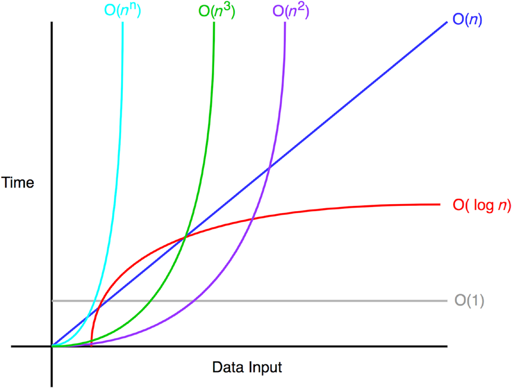

capitulo 1

## Notación BIG-O

-- Hamid Tizhoosh

> O(1) es santificado

Antes de aprender a implementar algorimos, deverias entender como analizar los efectos de estos.
Este capitulo se enfoca en el concepto de notacion BIO-O para el analisis de tiempo y analizis espacio-complejo.
Para el final del capitulo, deverias entender como analizar e implementar un algoritmo con respecto a estos dos conseptos (tiempo de ejecucion) y (consumo de memoria).

### Primera notacion BIG-O

La notación BIG-O mide la complejidad de el peor caso de un algoritmo.
En notación BIG-O la n representa el numero de inputs.
La pregunta respondida por BIG-O es la siguiente:
"¿Que ocurriria si n se aproxima a infinito?".
Cuando implementas un algoritmo, BIG-O es importante porque te dice que tan efisiente es el algoritmo.
La Figura 1-1 muestra algunas notaciones BIG-O frecuentes.



La siguiente seccion illustra esta usual complejidad temporal con algunos ejemplos.

### Ejemplos comunes

O(1) no cambia con respecto al espacio del input. Por lo tanto se dice que O(1) es de tiempo constante. Un ejemplo de un algoritmo O(1) es acceder al indice de un array mediante su indice.
O(n) es tiempo lineal y aplica para algoritmos que deverian realizar n operaciones en el peor de los casos.
Un ejemplo de un algoritmo O(n) es imprimir numeros de 0 a n-1, como se muestra aqui:

```js
function ejemploLineal(n) {
  for (var i = 0; i < n; i++) {
    console.log(i);
  }
}
```

Igualmente, O(n^2) es tiempo cuadratico, y O(n^3) es tiempo cubico.
Ejemplo de esta complejidad se muestran aqui:

```js
function ejemploCuadratico(n) {
  for (var i = 0; i < n; i++) {
    console.log(i);
    for (var j = i; j < n; j++) {
      console.log(j);
    }
  }
}

function ejemploCubico(n) {
  for (var i = 0; i < n; i++) {
    console.log(i);
    for (var j = i; j < n; j++) {
      console.log(j);
      for (var k = j; j < n; j++) {
        console.log(k);
      }
    }
  }
}
```

Finalmente, un ejemplo algoritmico de complejidad logaritmica en el tiempo es imprimir elementos que son potencias de 2 entre 2 y n.
Por ejemplo, ejemploLogaritmico(10) imprimiria lo siguiente

```js
1, 4, 8, 16, 32, 64;
```

La eficiencia de la complejidad tiempo-logaritmica es evidente con inputs grandes como un millon de items. Aunque n es un millon, ejemploLogaritmico pintara solo 19 items por que log2(1000000) = 19,9315. El codigo que implementa esta logica es la siguiente:

```js
function ejemploLogaritmico() {
  for(var i = 2; i<= n; i*2>) {
    console.log(i)
  }
}
```

### Reglas de Notacion BIG-O

Vamos a representar un algoritmo de complejidad f(n), n representa el numero de inputs, f(n)veces representa el tiempo nesecitado, y f(n)space representa el espacio (memoria adicional) necesaria para el algoritmo. La meta del analisis algoritmico es entender la eficiencia algoritmica mediante el calculo f(n). Eso puede ser desafiante de calcular f(n), la notacion BIG-O provee algunas reglas fundamentales que nos ayudan como desarrolladores para f(n).

- Regla del coeficiente:
  Si f(n) es O(g(n)), entonces kf(n) es O(g(n)), para cualquier constante k>0. La primera regla es la regla del coeficiente, que elimina coeficientes no reales de el tamaño del input. Esto es porque n se aserca a infinito, el otro coeficiente se vuelve insignificante.

- Regla de suma:
  Si f(n) es O(h(n)) y g(n) es O(p(n)), entonces f(n) + g(n) es O(h(n) + p(n)). La regla de suma simplemente establece que si la complejidad temporal es la suma de dos tiempos complejos diferentes, la resultante notacion BIG-O es tambien la suma de las dos notaciones BIG-O.

- Regla del producto (multiplicacion):
  Si f(n) es O(h(n)) y g(n) es O(p(n)), entonces f(n)g(n) es O(h(n)p(n)). Similarmente, la regla de multiplicacion establece que BIG-O se multiplica cuando la complejidad temporal se multiplica.

- Regla transitiva:
  Si f(n) es O(g(n)) y g(n) es O(h(n)), entonces f(n) es O(h(n)). La regla transitiva es una manera simple de complejidad temporal igual a el mismo BIG-O.

- Regla polinomial:
  Si f(n) es un de grado polinomial k, entonces f(n) es O(n^k). Intuitivamente, la regla polinomial establece que la complejidad temporal polinomial tiene BIG-O de el mismo grado del polinomio.

- Regla de potencia logaritmica: log(nk) es O(log(n)) para cualquier k > 0. Con la regla de ptencias logaritmicas, Las constantes dentro de una funcion logaritmica se ignoran de la notacion BIG-O.

Especial atencion en las primeras 3 reglas y la regla polinomial por que ellas son las mas usadas. Discutiremos cada regla en la siguiente seccion.

### Regla del coeficiente

Primero reveremos la regla del coeficiente. Esta regla es la regla mas facil de entender. Solo se requiere que ignores cualquier constante no relacionada con el tamaño del input. El coeficiente en BIG-O son despreciables con tamaño de input grandes. Por ende, esta es la regla mas importante de la notacion BIG-O.

> Si f(n) es O(g(n)), entonces kf(n) es O(g(n)),  
> para cualquier constante k > 0.

Esto significa que ambos 5f(n) y f(n) tienen la misma notacion BIG-O de O(f(n)).
Aqui un ejemplo de codigo con una complejidad temporal de O(n):

```js
function a(n) {
  var count = 0;
  for (var i = 0; i < n; i++) {
    count += 1;
  }
  return count;
}
```

este bloque de codigo tiene f(n) = n. Esto es porque agrega un conteo n veces. Por lo tanto esta funcion es O(n) en complejidad temporal:

```js
function a(n) {
  var count = 0;
  for (var i = 0; i < 5 * n; i++) {
    count += 1;
  }
  return count;
}
```

Este bloque tiene f(n) = 5n. Esto es porque corre desde 0 a 5n. Como sea los primeros dos ejemplos tienen notacion BIG-O de O(n). En palabras simples, esto es porque si n se acerca a infinito o otro numero grande, esas cuatro operaciones adicionales son insignificantes. Esto va a ejecutarce n veces. cualqueir constante es insignificante en notacion BIG-O.
El siguiente bloque de codigo demuestra otra funcion con una complejidad temporal lineal pero con una operacion adicional en la linea 6:

```js
1 |function a(n) {
2 |  var count = 0;
3 |  for (var i = 0; i < n; i++) {
4 |    count += 1;
5 |  }
6 |  count += 3;
7 |  return count;
8 |}
```

Finalmente, este bloque tiene f(n) = n + 1. Esto es +1 desde la ultima operacion (count+=3). Esto sique teniendo notacion BIG-o de O(n). Esto es porque esa operacion no depende del input n.
Para un n sercano al infinito, eso seria insignificante.

### Regla de la suma: "Add Big-Os Up"
